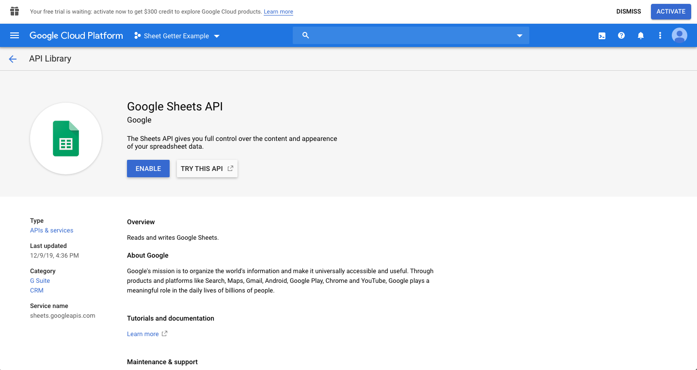

SheetGetter is a tiny nodejs class that helps you fetch data from google sheets.

## Example Usage

```javascript
let creds = JSON.parse(fs.readFileSync('service-account-creds-file-aweu54ug4igu.json'));
let sheetId = '1mjz4A4RzXN0hHj3Ww-nUOtk-WSrsi9B5-GvA-ZEuAKA';
let mySheetGetter = new SheetGetter(sheetId, creds);
mySheetGetter.getSheet('Animals with fraudulent diplomas')
  .then((res) => {
    let rows = res.data.values;
    // Do something with rows
  })
  .catch((err) => console.error(err));
```

See [the example directory](example).

## Setup

You need to setup three things:

1) Get the ID of your google sheet

2) Create a google cloud project, google service account, and download a credentials JSON file

3) Enable the google sheets and google drive APIs for your project

### Spreadsheet ID

This is the alphanumeric string following the `/d/` in a google sheets URL.

For example, if the sheets URL is https://docs.google.com/spreadsheets/d/1mjz4A4RzXN0hHj3Ww-nUOtk-WSrsi9B5-GvA-ZEuAKA, then `1mjz4A4RzXN0hHj3Ww-nUOtk-WSrsi9B5-GvA-ZEuAKA` is the Spreadsheet ID.

More info: https://developers.google.com/sheets/api/guides/concepts#spreadsheet_id.

### Service Account + Credentials JSON

SheetGetter expects a service account credentials json. Here's how you generate one of those:

1) Create a google account

2) Go to: https://console.cloud.google.com/iam-admin/serviceaccounts

3) Click "Create" to create a project:


4) Name the project and click "Create":


4) Click "Create Service Account":


5) Name your service account, and click "Create":


6) Give it the "Owner" role and click "Continue":


7) Click "Create Key":


8) Click "Create" to finally download the JSON credentials file, and finally click "Done":


9) Hooray! You should have successfully downloaded a service account credentials json file, and see a screen like this:


### Enable Google Sheets + Drive APIs

1) Go to the APIs library: https://console.cloud.google.com/apis/library


2) Type "sheets", and click on the Google Sheets API result:


3) Click "enable":



4) Repeat for the Google Drive API
